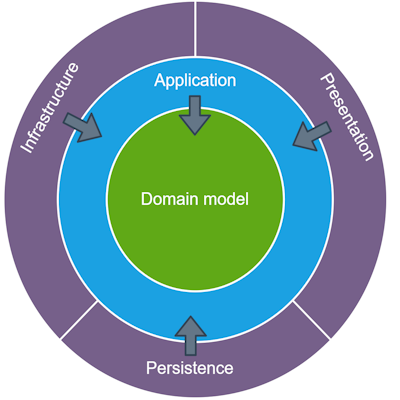

# Step 1 : Mise en place de la solution

On va commencer par comprendre la structure de notre solution. Pourquoi cette organisation ? 

Il n'y pas une façon de faire, je vous donne la mienne, basé sur pas mal de projet déjà réalisé. On part sur une architecture dit "en oignon".

## Structure globale

- 1-solution : répertoire listant les fichiers racines du projet (ex .gitignore)
- docs : doc en markdown (ce doc par exemple) ainsi que leurs illustrations
- src : répertoire contenant tout le code source de nos applications
- tests : répertoire contenant tous les projets de tests concernant les projets de src

Inclure la doc dans le projet permet de la soumettre au système de controle de version Git. Ainsi on embarque tout au même endroit. Beaucoup plus pratique que de dépendre d'un serveur web qq part, pas forcément à jour, voir inacessible. On y mettra donc aucune données sensibles tel que des clés ou des mots de passe. 

## Onion Architecture

On va avoir besoin de comprendre quelques conception d'archicture en "oignon" (l'image est celle des couches d'un oignon)

Tapez onion architecture dans votre moteur de recherche, section image. Vous allez tomber sur de nombreuses représentations des "couches" d'un oignon. Elles se ressemblent beaucoup, vous allez voir des couches nommées  "Infrastructure", "Application", "Domain", "Core". Cependant vous remarquerez quelques variantes avec des termes différents. 

<!--    -->

La seule règle c'est que toute les dépendances de vos projets vont vers le centre (core). Et que le centre (core) ne dépend de rien. C'est très important et c'est ce qui différencie cette achitecture à une architecture classique (Presentation Layer - Business Layer - Data Access Layer) où la couche business a une dépendance à la couche data access. 

Il existe beaucoup d'autre type d'architecture, détailler ici [Archictures](../ARCHITECTURES.md)

Dans une architecture oignon, il n'existe pas de dépendance pour la couche centrale. C'est la couche "database" qui a une dépendance à une couche inférieur (core). On utilise alors une interface (définie dans la couche core) implémentée dans la couche database. On obtient ainsi une séparation forte entre la logique metier et son infrastructure. 

Cette séparation permet d'ajouter facilement des tests sur chaque couche (sur chaque projet .net), indépendament des autres. Ceci permet aussi le remplacement d'une couche externe par une autre. Imaginez par exemple que l'on ait un service logging qui utilise uniquement la console (ce qu'on a de base avec .net). Un jour on décide passer sur un système de gestion online. Il faudra alors implémenter un nouveau service, qui fait la "même chose", c'est à dire basé sur une même interface.  

Autrement dit, on ne change pas la couche métier. Elle donne toujours des ordres comme "log moi ca", après c'est la couche infrastructure qui execute la demande. Comment ? La couche métier s'en contre fou et c'est pas son problème.

## Répertoire src

C'est une pratique commune que l'on retrouve dans quasiment tous les projets de développement. Src signifie source, autrement dit, notre code source. 

Ce répertoire est composé de 4 projets .net, dont un web. A ce stade ils sont tous vide. Cependant le projet web peut s'executer et affichera un Swagger vide. 

- **Onyx.Core** est le projet métier qu'on aurait pu appeler aussi "domain", est au centre de notre architecture. Il n'a aucune dépendance aux couches supérieures mais expose des interfaces pour les "utiliser". Il contient nos objets métiers. Il va aussi contenir nos services metiers (domain) qu'on aurait pu mettre dans un projet à part. Restons simple. 
- **Onyx.Application** consitue la couche intermédiaire entre le Core et le reste. Elle va servir d'autre couche supérieur comme une API Web ou une app mobile par exemple.
- **Onyx.Infrastructure** c'est ce projet qui va gérer une base de donnée, un système de fichier, un service web etc. Imaginez que la couche application demande un "Update" d'une donnée, la couche infrastructure s'en occupe. Peut importe comment, sur une base de données, dans un cloud, la couche application n'a pas à le savoir.
- **Onyx.Web.Api** c'est notre projet de "présentation" (ca aurait pu être un site web ou une app mobile). Il va utiliser les services de la couche application pour exposer des endpoints accessibles depuis le web. 

## Répertoire test

Ce répertoire parle de lui même, on y trouve un projet test par projet src. Ce sont nos tests unitaires. On verra plus tard que l'on aura d'autre type de projet tests.

