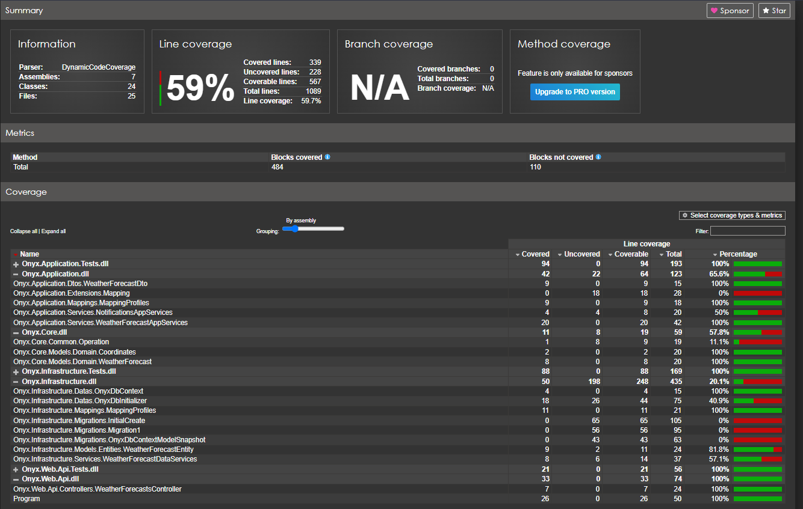
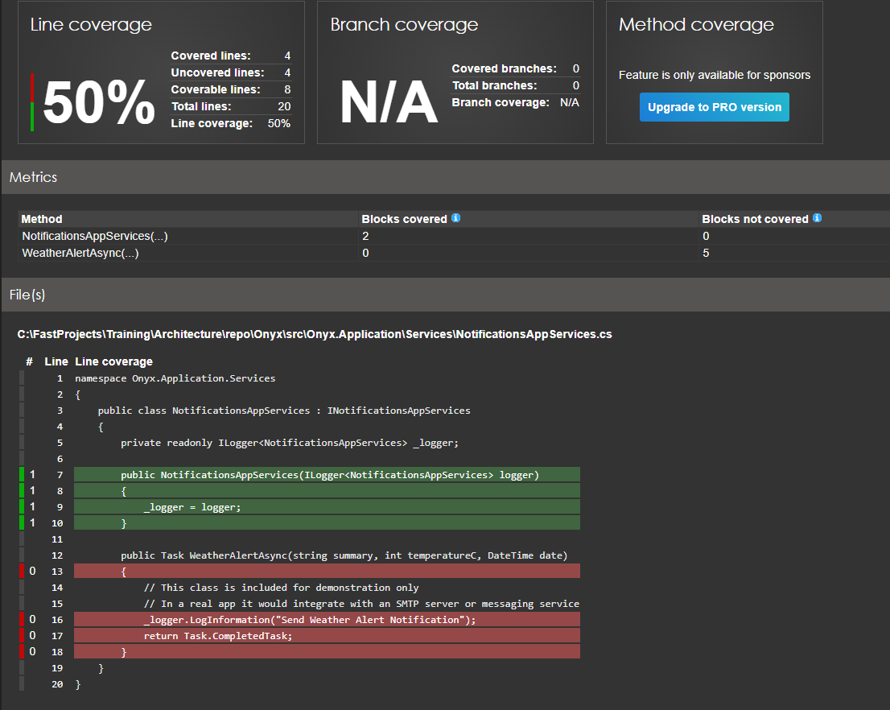
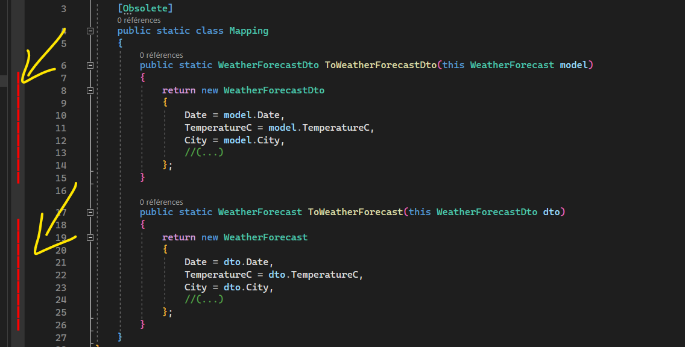
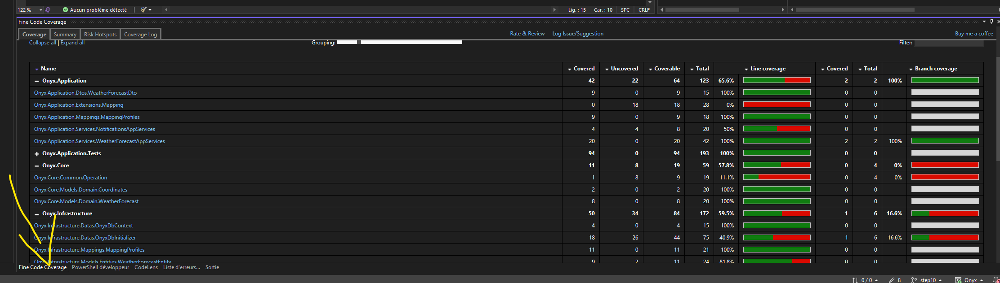

# Step 10 : Code Coverage

*Les tests unitaires permettent de garantir la fonctionnalité et de fournir un moyen de vérification pour les efforts de refactorisation. La couverture du code est une mesure de la quantité de code exécutée par des tests unitaires : lignes, branches ou méthodes. Par exemple, si vous disposez d’une application simple avec seulement deux branches conditionnelles de code (branche a et branche b), un test unitaire qui vérifie qu’une branche conditionnelle a signale la couverture du code de branche de 50 %.*
 
 Source : https://learn.microsoft.com/fr-fr/dotnet/core/testing/unit-testing-code-coverage?tabs=windows
 
## Outils payants

Si vous avez la version Entreprise de Visual Studio, vous avez toutes les fonctionnalités à disposition :
https://learn.microsoft.com/en-us/visualstudio/test/using-code-coverage-to-determine-how-much-code-is-being-tested?view=vs-2022&tabs=csharp

Vous pouvez aussi opter pour des outils payants comme Dotcover : https://www.jetbrains.com/dotcover/ des supers outils de JetBrains. 


Si vous n'avez pas tout cela, la suite pourrait vous intéresser.

## Coverlet

Coverlet est un projet open source qui fait partie de la fondation.net qui fournit un service de couverture de code, en collectant des données d'execution de test qui seront ensuite utilisées pour la génération de rapports. La génération de rapport se fait avec un autre outil open source "Report Generator"

- https://github.com/coverlet-coverage/coverlet
- https://github.com/danielpalme/ReportGenerator

Lorsque vous créer un projet de test unitaire avec xUnit sour Visual Studio 2022, vous avez par défaut un package installé : coverlet.collector

```
    <PackageReference Include="coverlet.collector" Version="3.2.0">
      <IncludeAssets>runtime; build; native; contentfiles; analyzers; buildtransitive</IncludeAssets>
      <PrivateAssets>all</PrivateAssets>
    </PackageReference>
```

### Première collecte de données

Ouvrez un terminal et naviguez vers la racine de la Solution /Onyx (au même niveau que le fichier OnyxSolution.sln) 

On va commencer par installer ces deux outils :

```
dotnet tool install -g dotnet-coverage
dotnet tool install -g dotnet-reportgenerator-globaltool
```
Ensuite on génère une collection de données de couverture de code, dans un fichier 'coverage.xml' 

 ```
dotnet-coverage collect -f xml -o coverage.xml dotnet test 
```

Enfin on génère un rapport html issue du fichier coverage.xml dans le dossier .report avec un filtre sur les dll Onyx.* (sinon, si vous avez d'autre projet, il va tout scanner)

```
reportgenerator -reports:coverage.xml -targetdir:.\report -assemblyfilters:+Onyx.*
```

Ceci va générer un ensemble de fichier, dont index.html que je vous invite à ouvrir.




Notez qu'on obtient un score de 59%. C'est une indication globale qui n'a pas beaucoup d'intérêt car certaine class sont à 0%, or on ne devrait pas les tester. Exemple :
- Onyx.Infrastructure.Migrations.InitialCreate	
- Onyx.Infrastructure.Migrations.Migration1
- Onyx.Infrastructure.Migrations.OnyxDbContextModelSnapshot 
  
Ces classes sont générées par dotnet ef (entity framework) et n'ont pour but que de mettre à jour la base de données. Pas d'intérêt à tester cela.

Toujours est il que cela reste intéressant. Par exemple la classe non testé (score à 0%) Onyx.Application.Extensions.Mapping n'est plus à tester car elle est obsolete (remplacé par automapper). C'est donc un moyen de faire le ménage dans le code. 

En cliquant sur un lien cela nous ouvre le détail d'une classe et nous affiche en rouge le code non testé. Exemple avec NotificationsAppServices



Mais est ce que cela ne serait pas plus pratique d'avoir cela directement dans notre IDE, au lieu de taper des lignes de commande ?

### Fine Code Coverage

Et merci à Fortune Ngwenya qui mets à disposition cette extension Visual Studio 2022

https://marketplace.visualstudio.com/items?itemName=FortuneNgwenya.FineCodeCoverage2022

Une fois installer, lancer tout vos tests. Ca va permettre de faire en gros les étapes ci dessus automatiquement.

L'extension nous permet d'afficher les lignes de codes non testées en rouge :



Et les rapports dans un onglet en bas de page :



Elle est pas belle la vie :)


