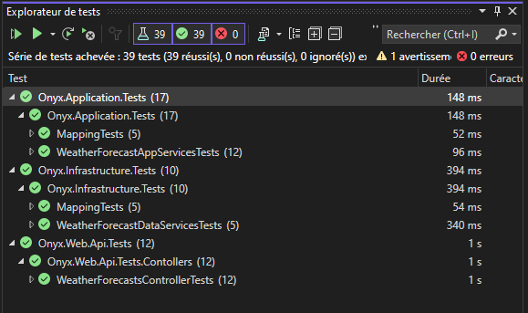
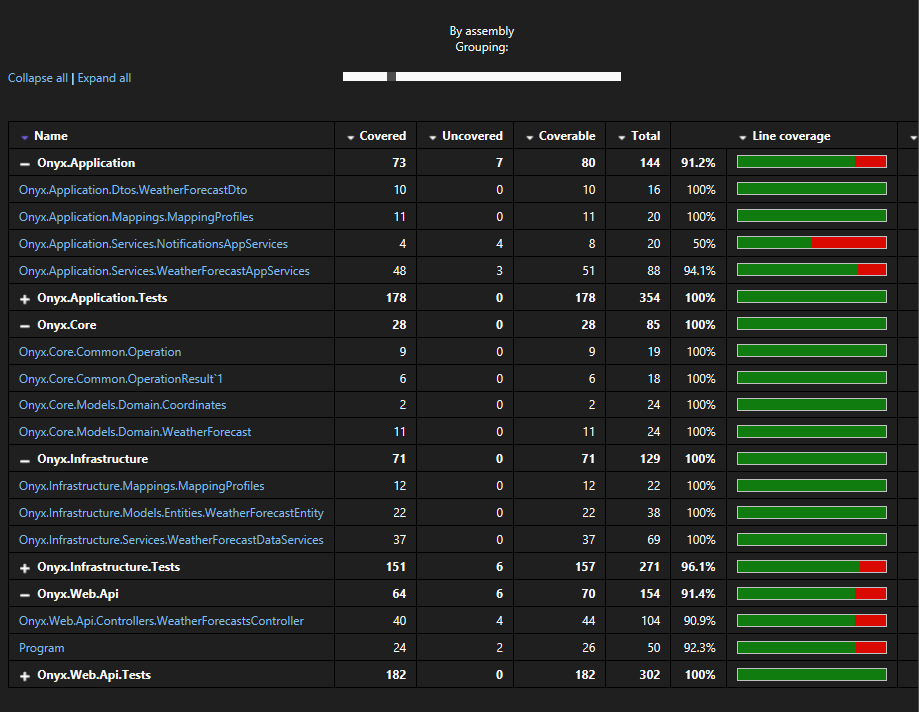
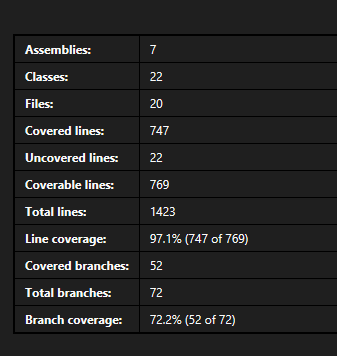

# CRUD : Implémentation et Tests

Cette étape consiste à implémenter toutes les fonctionalités liées au CRUD (Create, Read, Update, Delete) qui sont les opérations de bases sur notre objet de bulletin météo. 

Ensuite on créera les tests unitaires pour chaque cas, afin de couvrir un maximum de code. 

## App Service CRUD

J'ai crée une nouvelle interface IAppServices qui sera la base pour chaque nouveau services AppServices : 

```c#
public interface IAppServices<T>
{
    public Task<IEnumerable<T>?> GetAllAsync();

    public Task<OperationResult<T?>> GetByIdAsync(Guid guid);

    public Task<OperationResult<Guid>> SaveAsync(T dto);

    public Task<Operation> DeleteAsync(Guid guid);
}

public interface IWeatherForecastAppServices : IAppServices<WeatherForecastDto>
{
    //Task<IEnumerable<WeatherForecastDto>?> GetAllWeatherForecasts(); Replaced by GetAllAsync in IAppServices

    //Task<Operation> CreateWeatherForecasts(WeatherForecastDto weatherForecastDto); Replaced by SaveAsync in IAppServices
}
```

J'ai refactoré GetAllWeatherForecasts et CreateWeatherForecasts qui deviennent GetAllAsync et SaveAsync.

Notez qu'on a rajouter aussi un objet de retour OperationResult. Celui ci va nous permettre de gérer tous les cas problématiques:
- erreur technique, non voulu => log, il faut remonter l'erreur (ou pas) et la gérer.
- erreur fonctionnelle, cad une erreur qui fait partie de la logique, comme par exemple rechercher un objet en base par son id, mais ne pas le trouver. Pour une API WEB c'est un retour code erreur 204.


## Data Service CRUD

De la même manière on va créer de nouvelle signature de méthode pour gérer le CRUD avec le context Entity Framework.

Du nouveau ici. L'objet WeatherForecastEntity doit maintenant implémenter l'interface IAudit.

IAudit est une interface qui est composé d'un Guid, d'une date de creation et d'une date de modification. Comme sont nom l'indique, cela permet "d'auditer" l'objet et de garder une trace de celui ci. On pourrait à l'avenir ajouter un id d'un utilisateur qui l'a modifié dernièrement, une IP ou que sais-je. 

Tous les Objets Entity devront à l'avenir implémenter cette interface.


```c#

public interface IAudit
{
    Guid Id { get; } //Make a private set in class !!!
    DateTime CreatedAt { get; } //Make a private set in class !!!
    DateTime ModifiedAt { get; set; }

    void Init(Guid id, DateTime createdAt);//usefull for tests to set private fields
}

public class WeatherForecastEntity : IAudit
{
    public WeatherForecastEntity()
    {
        Init(Guid.NewGuid(), DateTime.UtcNow);
    }

    public void Init(Guid id, DateTime createdAt)
    {
        Id = id;
        CreatedAt = createdAt;
        ModifiedAt = createdAt;
    }

    public Guid Id { get; private set; }
    
    (...)

    public DateTime CreatedAt { get; private set; }
    public DateTime ModifiedAt { get; set; }
```

Le constructeur de la classe force la création d'un nouveau Guid à l'instanciation (et met à jours les dates).

On à un point à faire sur les Ids.

### Id en base de données

On a deux manière de faire. 
- soit on laisse la base de données gérer cette clé primaire Id (décoré avec l'attribut [DatabaseGenerated(DatabaseGeneratedOption.Identity)])
- soit on le gère coté code

Ici on le gère côté code. Il faut rendre l'Id accessible en lecteur (get) mais pas en écriture, sauf à l'instanciation (private set). J'aurais bien voulu le définir dans l'interface pour le forcer à l'implémentation, mais une interface ne définie que des membres public par défaut.

Donc faut le faire manuellement public Guid Id { get; private set; } (idem pour CreatedAt car il n'est créer qu'une fois)

Pourquoi un Guid ?

Pour une question de simplicité et de sécurité. Avoir un Id non devinable nous évite quelques soucis. 

`
*Exemple concret : il fût une époque où, sur un site de rencontre à la sécurité douteuse, les photos étaient accessibles via un path du genre /api/users/UIOSOHF/photos/55. En voyant cela, on est tenté de taper 56 ou 54... et pourquoi pas faire une boucle de récupération d'images ? UIOSOHF étant l'id utilisateur, il suffit de récupérer celui d'un autre profil et on obtient un joli book photos. Et surprise, on s'apperçoit en plus que les photos qui ont été refusées par la modération ne sont pas effacées... Je vous laisse imaginer ce qu'est une photo refusée sur un site de rencontre. Vous voyez ce qu'un guid aurait apporté dans ce cas. Bien entendu on a d'autre moyen de sécuriser cela, mais c'est pas le sujet.*
`

### Mapping :

Il faudra penser à ignorer le mapping de l'Id et de la date de création, entre le domain et l'infrastructure

```
CreateMap<WeatherForecast, WeatherForecastEntity>()
    .ForMember(dest => dest.Id, opt => opt.Ignore()) //Important, readonly
    .ForMember(dest => dest.CreatedAt, opt => opt.Ignore()) //Important, readonly
```

Pourquoi ? Car l'Id et la date de création sont en lecture seule (private set) et ne peuvent pas être mis à jour en dehors de leurs constructeurs. 

# Tests 

## AutoFixture
https://autofixture.github.io/docs/quick-start/#

On introduit un nouvel outil ici, AutoFixture. Super pratique. 

AutoFixture permet de remplir aléatoirement toutes les propriétés d'un objet. Un gain de temps considérable. Et cela permet de detecter de nouveau cas de test qui aurait pu passer inaperçut. 

## Base de données en mémoire

On a de nouvelles méthodes, on va devoir écrire de nouveau test. Je vous laisse découvrir ces tests 
- Applicatifs
- Infrastructure
- Web Api

Quelques petits changement, dans les test d'infrastructure :

```
.UseInMemoryDatabase(databaseName: $"TestDatabase{Guid.NewGuid().ToString()}")
```

Les tests partagaient jusque là une base de données en mémoire. Comme ce sont des tests unitaires ont aimerait bien les isoler, sinon, suivant l'ordre ou le timing d'execution, certain pourrait se marcher sur les pieds. Pour cela, on peut ajouter un nom aléatoire à la base de données, qui à chaque test aura un nouveau nom. Ainsi on est certain que chaque test s'execute avec sa propre base de données en mémoire. 

# Conclusion

A ce stade, on a du CRUD sur notre bulletin météo sur toute notre chaine : 
API Web => Applicatif ==> Core ==> Infrastructure ==> BD

Et des tests unitaires un peu partout :
- Web Api : on test les retours de message principalement
- Applicatif : on test la logique applicative metier
- Infrastructure : on test le comportement que l'on attend de la couche de persistance des données
- Core : pas de test pour le moment (on a que des classes d'objet sans logique)

On a 39 tests unitaires :


La couverture de code n'est pas parfaite :

Le service de notification est clairement pas assez testé. 


Mais on couvre quand même 97% du code !


Les tests unitaires c'est très bien, mais les tests d'intégration c'est mieux !


