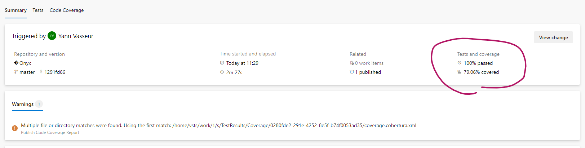
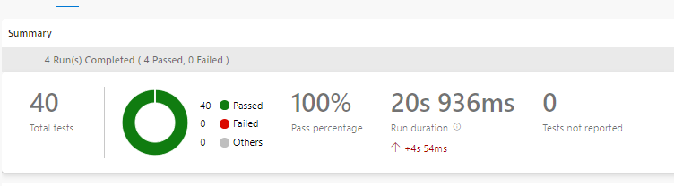
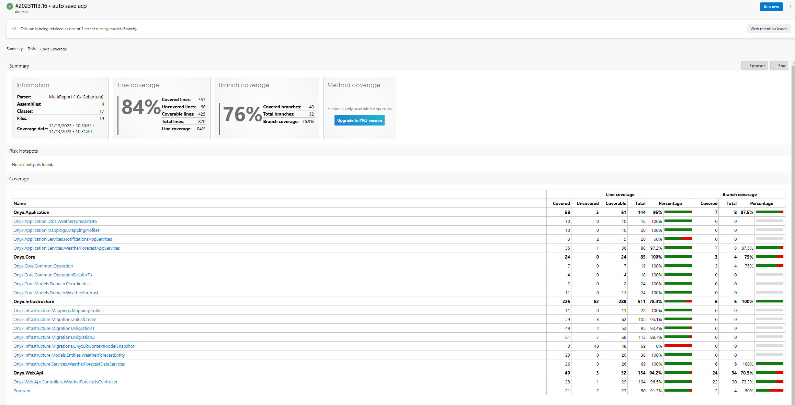

# Pipeline avec Code Coverage

Ce qui serait intéressant c'est de pouvoir consulter les rapports de couverture de code en ligne sur AzureDevops. 
En tant que dev, on a déjà ces résultats en local. Mais faut lancer un Visual Studio. Peut être qu'un non dev serait intéressé. Par exemple un tech lead qui n'a plus le temps de coder mais veut simplement superviser son repo. 

On va rajouter quelques lignes à notre pipeline pour afficher ces tests à chaque fois qu'un job AzureDevops est lancé. 


## Pipeline 

J'ai volontairement commenté la fin de la pipeline car nous n'avons pas de serveur de production, donc aucun intérêt à publier notre code. 

Voilà ce qui nous intéresse :

```yaml

# Run Tests
- task: DotNetCoreCLI@2
  displayName: 'Run unit tests - $(buildConfiguration)'
  inputs:
    command: 'test'
    arguments: '--configuration $(buildConfiguration) --logger trx --results-directory "$(Build.SourcesDirectory)/TestResults/Coverage/"  --collect "XPlat Code Coverage"'
    publishTestResults: false
    projects: '**/*.Tests.csproj'

# Publish Test Results
- task: PublishTestResults@2
  displayName: 'Publish Test Results'
  inputs: 
    testResultsFormat: VSTest
    testResultsFiles: '**/*.trx'
    searchFolder: '$(Build.SourcesDirectory)/TestResults/Coverage/'
    
# Install Tool ReportGenerator
- task: DotNetCoreCLI@2
  displayName: 'dotnet Tool Install "reportgenerator"'
  inputs:
    command: custom
    custom: tool
    arguments: 'install -g dotnet-reportgenerator-globaltool'

# Create Code Coverage Report
- task: PowerShell@2
  displayName: 'Create Code Coverage Report'
  inputs:
    targetType: 'inline'
    script: reportgenerator -reports:$(Build.SourcesDirectory)/**/coverage.cobertura.xml -targetdir:$(Build.SourcesDirectory)/CodeCoverage -reporttypes:HtmlInline_AzurePipelines

# Publish Code Coverage Report
- task: PublishCodeCoverageResults@1
  displayName: 'Publish Code Coverage Report'
  inputs:
    codeCoverageTool: 'cobertura'
    summaryFileLocation: '$(Build.SourcesDirectory)/**/coverage.cobertura.xml'

```

- Nous avons rajouté des arguments à notre tache 'dotnet run' pour que la collecte de couverture de code et l'intègre dans un fichier .trx (VSTest format). publishTestResults: false, car a priori, on ne peut pas avoir à la fois la couverture de code et le résultat du test en settant à true cet argument. https://build5nines.com/azure-pipeline-publish-unit-test-and-code-coverage-results-with-net-solution-using-vstest-cobertura-and-coverlet/

- L'étape suivante consiste à publier les résultats de test avec le fichier .trx que l'on vient précédement de générer.

- On install ensuite l'outil reportgenerator, le même qui nous sert en local. 

- Que l'on utilise pour générer nos rapport de couverture de code. 

- Ensuite on les publie. 

## Résultats

Une fois le code commit + push, le fichier yaml est mis à jour sur la branche master qui du coup, déclanche ce même fichier dans job, dont voici le résultat :




Notez qu'en haut à droite deux nouvelles informations sont disponibles 100% Passed et 79.06% covered
Vous pouvez cliquez sur ces liens qui vous meneront vers une page de résumé de vos test + les rapports de code coverage :





Notez aussi ce message de warning
```
##[warning]Multiple file or directory matches were found. Using the first match: /home/vsts/work/1/s/TestResults/Coverage/0280fde2-291e-4252-8e5f-b74f0053ad35/coverage.cobertura.xml
```

J'ai pas réussi à enlever ce warning. Mais je pense que c'est lié à la façon dont les différents rapports sont assemblé. J'ai pas la main la dessus et à vrai dire, j'ai ce que je veux à ce stade. 

# Conclusion

On a vu ici comment enrichir notre pipeline pour ajouter un rapport de couverture de code, qui peut s'avérer intéressant pour des non développeurs qui n'ont pas forcément accès à une machine dev ou tout simplement pour centraliser ces rapports. 


