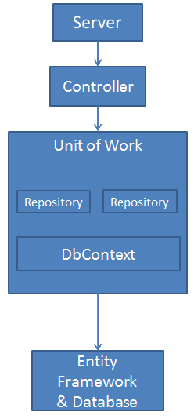

# Step 5 : Repository Pattern & Entity Framework

Nous venons de coder la partie "applicative" de notre app.

 
 |  
---|---
 
Pour autant nous n'avons pas terminé car pour le moment, nos données sont en dur dans le code :

```c#
public async Task<IEnumerable<WeatherForecastDto>?> GetAllWeatherForecasts()
{
    var mockList = new List<WeatherForecastDto>()
    {
        new WeatherForecastDto()
        {
             TemperatureC = 19,
             City = "Paris"
        },
        new WeatherForecastDto()
        {
             TemperatureC = 24,
             City = "Rennes"
        }
    };

    return mockList;
}
```

On commence à approcher la partie persistance des données, c'est à dire comment on stocke et récupère nos données.

Dans une application monolithe classique, on appelle en général cette couche Data Access Layer ou DAL pour les intimes. Elle s'occupe comme son nom l'indique d'aller chercher en base de donnée, sur un fichier, dans le cloud ou sur une disquette (vous l'avez pas vu venir celle la) des données. 

Une DAL à un facheux défault, c'est que la couche Business Layer (qui serait l'équivalent de notre Core ou Domain) du dessus en dépend. Or si on veut respecter la Clean Architecture, le Core ne doit dépendre de RIEN. On va passer par une interface pour isoler ces couches. Ainsi, notre application ne dépendra plus d'une couche de base de données comme c'était le cas avant, mais d'un contrat (interface) qu'on initialisera avec de l'injection de dépendance. 

Notre couche persistance de données va se trouver dans notre projet "Infrastructure". Notez que sur l'image ci dessus, la "Persistance" est séparée de l'infratstructure qui elle meme est séparée de la couche présentation. Dans mon projet, j'ai bien une couche présentation séparée (Projet Web.Api). Par contre le reste se trouve dans Infrastructure. 

J'ai volontairement laissé des images d'architecture pas en phase à 100% avec ce projet pour deux raisons :
- 1 j'ai la fleme d'en refaire
- 2 ya pas qu'une seule façon de faire, et faut en avoir conscience. Ca permet de se poser des questions.

## Repository Pattern

Le patron Repository est utilisé pour abstaire la persistance ou la récupération de données, en général d'une base de données. Dit autrement, du point de vue des autres couches de l'application, en particulier la couche applicative, on pas besoin de savoir comment sont stockées ou récupérées nos données, tout ce que l'on veut c'est un moyen de le faire. 

Ce moyen va être défini par une interface commune (située dans le Core et ainsi connue de tous)

### Définitions 

Vous allez voir des noms d'objets su style "Model", "Entities", "Dto", "Dao" ou que sais je encore. J'ai vu au cours de m'a carrière plusieurs définitions au sein de chaque équipe projet. Aussi, ces termes sont différents selon les languages de programations, l'expérience ou l'historique d'un projet. Au final, on s'y perds un peu.
- Model : terme super générique qui va définir nos objets. On retrouve se terme partout. Trop vague et confusant.
- DTO : Data Transfert Object, celui ci est plutôt clair et assez partagé par tous, c'est en gros un objet serialisable qui va finir en string JSON pour faire du transfert entre API et client, ou API et API. 
- DAO : Data Access Object. Objet proche d'une BD (qui recopie en général les colonnes d'une table)
- Entity : terme aussi générique mais qui dans le monde .net à un sens si on utilise Entity Framework (EF), ce serait un DAO. Mais en DDD (Domain Driven Devlopement) C'est un objet metier. Confusant.

(Je ne rentre pas dans le DDD ou on aurait aussi Aggregate, Value Object, etc...)

Dans ce projet, voila ce que moi j'entends 
- Model : Domain Model, ou Core. Objet métier de base. Proche de la logique métier.
- DTO : Data Transfert Object 
- DAO : Pour m'a part je ne l'utilise pas, pour la raison qui suit.
- Entity : je vais utiliser EF qui nomme ses objets "Entity". Pour ne pas confondre, je vais garder le terme entity à ce niveau. 

Ces objets sont situées dans des couches différentes et vont devoir tranférer leurs données mutuellement. C'est le "mapping". (Qu'on verra plus tard)

D'ailleur EF est un ORM qui signifie "Object Relational Mapping". On les retrouvent devant une base de données et font l'intermédiaire avec notre code et la base de données. C'est super pratique mais pas forcément adapté à tous les projets.

### La version courte

Un Repository ou repo (à ne pas confondre avec un repo git) se résume en général à du CRUD (Create, Read, Update, Delete), le read est splité en deux avec un GetById et un GetAll(). Avec cela on couvre 95% des besoins. 

Comme ce sont des actions de bases d'un repo que quasi tous les Entities vont adopter, on crée une interface générique que sera implémenté par une classe "service" qui fera le job.

Ainsi notre interface ressemblera à qq chose comme cela

```c#
public interface IRepository<T> 
    Task<List<T>> GetAllAsync();
    Task<T?> GetByIdAsync(Guid id);
    void Insert(T entity);
    void Update(T entity);
    void Delete(T entity);
}
```

### Unit of Work Pattern

Une autre notion importante à comprendre lié au Repository Pattern c'est le Unit of Work.

Le pattern Unit of Work, selon Martin Fowler, maintient une liste d’objets affectés aux travers d’une transaction, il coordonne les modifications apportées à l’écriture et traite les éventuels problèmes de concurrence.

 

Voyez le comme un chef d'orchestre qui gère à la fois les données de la base de données en lecture et écriture, ainsi qu'en mémoire une liste d'objets, ce qui pourrait s'apparenter à du cache quelque part. 


### Entity Framework fait il doublon ?

La question est, est ce que EF c'est pas déjà tout ça ? 

DbContext => Unit of Work
DbSets => Repositories

 

Du coup, pourquoi rajouter une couche qui fait la même chose ?

Ce design pattern est sujet à contreverse avec l'utilisation Entity Framework, par exemple :

 - Generic Repository Pattern With EF Core - Why It Sucks : https://www.youtube.com/watch?v=Bz5JCbWnaHo


### Comment je vois les choses

Pour rappel, on souhaite implémenter la couche de persistance des données, peut importe comment, avec ou SANS EF, sur une base relationnelle ou un système de fichier, peu importe. Cela doit rester une abstraction. 

Cette abstraction est essentielle si on veut respecter la Clean Architecture. 

On ne doit pas dépendre d'un framework comme EF. C'est de la tambouille interne.

- Repository Pattern with C# and Entity Framework, Done Right | Mosh https://www.youtube.com/watch?v=rtXpYpZdOzM

Prenons un exemple, sur notre projet de bulletin météo. On pourrait directement utiliser EF et aller chercher toutes nos données en base. (et c'est ce qu'on va faire) Un jour on pourrait aussi se dire que EF fait plus l'affaire et qu'une procédure stockées irait plus vite. Ca c'est l'affaire de l'Infrastructure. De plus, si un jour on sépare la lecture de l'ecriture avec CQRS, c'est dans l'implémentation de l'interface que l'on expose qui sera affecté et surtout pas l'interface.


A ce stade, la seule chose qu'on doit faire c'est répondre à ce besoin 

```c#
Task<IEnumerable<WeatherForecastDto>?> GetAllWeatherForecasts()
```

Ce sera donc notre interface. Tout simplement. 

Pour ma part, je considère que c'est un Service qui me donne des données, ce sera donc un IDataService que je vais créer. C'est beaucoup plus parlant que le mot Repository, mais on verra qu'en fait c'est la même chose. (d'où cette longue introduction)

### Couche d'astraction générique

On en a pas besoin spécifiquement pour notre exemple qui reste qu'un simple "Get". Cependant, préparons le terrain pour toutes les autres demandes à venir du CRUD.

```C#
 public interface IDataService<T>
 {
     Task<T?> GetAsync(string id);

     Task<IEnumerable<T>?> GetAllAsync();

     Task AddOrUpdateAsync(T entity);

     Task DeleteAsync(string id);
 }
```

Notez que j'apporte quelques petites subtilités :
- AddOrUpdate dans le même appel. En effet, d'un point de vu applicatif, on s'en fou que ce soit un ajout ou un update, on aurait pu appeler ca "Save" quelque part. Mais je garde la notion de Ajoute ou Met à jour. Car on sait que derrière ça va faire l'un ou l'autre. Alors que "Save" on sait pas.  
- Delete ne prend pas une Entity mais un Id, c'est un choix de ma part. L'id est un Guid en général, mais un string est plus permissif. 

T est le generic de le l'objet que l'on souhaite gérer. Mais est-ce une Entity (un objet EF "base de donnée") ou un autre objet et si oui lequel ? Ce ne doit pas être un EF Entity car c'est un objet qui sera uniquement utilisé au sein de la couche Infrastructure. Tambouille interne. 

C'est donc un objet extérieur. Est ce un DTO ? Pas recommandé mais je vois pas pourquoi on pourrait pas en avoir un. Pourquoi passer par la couche métier sur un simple "Get" où l'on a pas de logique. Cela éviterait un mapping. Ya débat. 
Et si on a un nouveau projet de présentation style WPF, qui lui s'en fou du DTO ? Pour rester cohérent, c'est un objet métier dont on a besoin ici.

Donc un Onyx.Core.Models.Domain.WeatherForecast

### Abstractions 

Pour le service d'accès aux données des bulletins météos, on va créer une seconde interface qui elle va dépendre de IDataService\<WeatherForecast\>

```c#
public interface IWeatherForecastDataServices : IDataService<WeatherForecast>
{
}
```

Pourquoi faire ceci ? Cela permet d'ajouter d'autre signature de méthode plus tard. Par exemple GetAllFromFrance(). 

Voici le service qui implémente l'interface IWeatherForecastDataServices

```c#
    public class WeatherForecastDataServices : IWeatherForecastDataServices
    {
        public async Task<IEnumerable<WeatherForecast>?> GetAllAsync()
        {
            var mockList = new List<WeatherForecast>()
            {
                new WeatherForecast()
                {
                    TemperatureC = 19,
                    City = "Paris"
                },
                new WeatherForecast()
                {
                    TemperatureC = 24,
                    City = "Rennes"
                }
            };

            return mockList;
        }

        public Task<WeatherForecast?> GetAsync(string id)
        {
            throw new NotImplementedException();
        }

        public Task AddOrUpdateAsync(WeatherForecast entity)
        {
            throw new NotImplementedException();
        }

        public Task DeleteAsync(string id)
        {
            throw new NotImplementedException();
        }
    }
```

Notre service est prêt, pensons à l'injecter tout de suite dans notre Program.cs de notre API, sans quoi ça va râler à l'execution.

```c#
builder.Services.AddSingleton<IWeatherForecastDataServices, WeatherForecastDataServices>();
```

Maintenant dans WeatherForecastAppServices :

```c# 
public class WeatherForecastAppServices : IWeatherForecastAppServices
{
     private readonly INotificationsAppServices _notificationsService;
     private readonly IWeatherForecastDataServices _weatherForecastDataServices;

     public WeatherForecastAppServices(
         INotificationsAppServices notificationsService,
         IWeatherForecastDataServices weatherForecastDataServices)
     {
         _notificationsService = notificationsService;
         _weatherForecastDataServices = weatherForecastDataServices;
     }

     public async Task<IEnumerable<WeatherForecastDto>?> GetAllWeatherForecasts()
     {
        var weatherForecastDtoList = await _weatherForecastDataServices.GetAllAsync();

        return weatherForecastDtoList.Select(x => new WeatherForecast(x));
     }
     
     (...)
```

On injecte notre nouveau service IWeatherForecastDataServices que l'on utilise à la place des mocks. 

Notez que le service nous retourne des objets métiers, or le service retourne des DTOs. Il va falloir convertir. 

J'ai volontairement introduit une erreur ici. On pourrait créer un contructeur dans la classe WeatherForecast qui prend en parametre un objet WeatherForecastDto et map (à la main) toutes les propriétés de l'objet (Date, TemperatureC ...)

```c# 
public WeatherForecast(WeatherForecastDto dto)
{
    Date = dto.Date,
    TemperatureC = dto.TemperatureC
    (...)
}
```
et ensuite utiliser cette ligne

```c# 
return weatherForecastDtoList.Select(x => new WeatherForecast(x));
```

Mais on doit référencer le projet Application dans le projet Core. C'est une violation de la règle que l'on s'est fixée. Core est indépendante !

Autre solution, on peut créer dans le projet Onyx.Application une extension qui ferait ce job (dans les deux sens) :

```c# 
public static WeatherForecastDto ToWeatherForecast(this WeatherForecast dto)
{
    return new WeatherForecastDto
    {
        Date = dto.Date,
        TemperatureC = dto.TemperatureC
        //(...)
    };
}

public static WeatherForecast ToWeatherForecast(this WeatherForecastDto dto)
{
    return new WeatherForecast
    {
        Date = dto.Date,
        TemperatureC = dto.TemperatureC
        //(...)
    };
}
```

ensuite dans notre WeatherForecastAppServices
```c# 
return weatherForecastDtoList.Select(x => x.ToWeatherForecastDto());
```

Et ça marchera. Cependant on va vite comprendre pourquoi on va avoir besoin d'un Mapper. La suite dans le prochain épisode.

### Tests

Nos tests Onyw.Application.Tests ne fonctionnent plus car il nous manque l'injection d'un mock de IWeatherForecastDataServices. 


https://learn.microsoft.com/en-us/dotnet/architecture/microservices/microservice-ddd-cqrs-patterns/infrastructure-persistence-layer-design


 