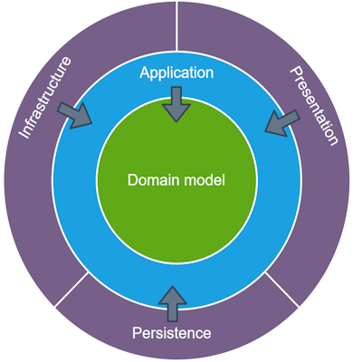

# Step 5 : DataService

Nous venons de coder la partie "applicative" de notre app.

 
 |  
---|---
 
Pour autant nous n'avons pas terminé car pour le moment, nos données sont en dur dans le code :

```c#
public async Task<IEnumerable<WeatherForecastDto>?> GetAllWeatherForecasts()
{
    var mockList = new List<WeatherForecastDto>()
    {
        new WeatherForecastDto()
        {
             TemperatureC = 19,
             City = "Paris"
        },
        new WeatherForecastDto()
        {
             TemperatureC = 24,
             City = "Rennes"
        }
    };

    return mockList;
}
```

On commence à approcher la partie persistance des données, c'est à dire comment on stocke et récupère nos données.

Dans une application monolithe classique, on appelle en général cette couche Data Access Layer ou DAL pour les intimes. Elle s'occupe comme son nom l'indique d'aller chercher en base de donnée, sur un fichier, dans le cloud ou sur une disquette (vous l'avez pas vu venir celle la) des données. 

Une DAL a un facheux défaut, c'est que la couche Business Layer (BL) du dessus en dépend (BL est l'équivalent de notre Core, avec des dépendances) . Or si on veut respecter la Clean Architecture, le Core ne doit dépendre de RIEN. On va passer par une interface pour isoler ces couches. Ainsi, notre application ne dépendra plus d'une couche de base de données comme c'était le cas avant, mais d'un contrat (interface) qu'on initialisera avec de l'injection de dépendance. 

Notre couche persistance de données va se trouver dans notre projet "Infrastructure". Notez que sur l'image ci dessus, la "Persistance" est séparée de l'infratstructure qui elle meme est séparée de la couche présentation. Dans mon projet, j'ai bien une couche présentation séparée (Projet Web.Api). Par contre le reste se trouve dans Infrastructure. 

J'ai volontairement laissé des images d'architecture pas en phase à 100% avec ce projet pour deux raisons :
- 1 j'ai la fleme d'en refaire
- 2 ya pas qu'une seule façon de faire, et faut en avoir conscience. Ca permet de se poser des questions.
 
A ce stade, la seule chose qu'on doit faire c'est répondre à ce besoin de la couche applicative :

```c#
Task<IEnumerable<WeatherForecastDto>?> GetAllWeatherForecasts()
```
### Couche d'astraction générique : IDataService

On en a pas besoin spécifiquement pour notre exemple qui reste qu'un simple "Get". Cependant, préparons le terrain pour toutes les autres demandes à venir du CRUD.

```C#
 public interface IDataService<T>
 {
     Task<T?> GetAsync(string id);

     Task<IEnumerable<T>?> GetAllAsync();

     Task AddOrUpdateAsync(T entity);

     Task DeleteAsync(string id);
 }
```

Notez que j'apporte quelques petites subtilités :
- AddOrUpdate dans le même appel. En effet, d'un point de vu applicatif, on s'en fou que ce soit un ajout ou un update, on aurait pu appeler ça "Save" quelque part. Mais je garde la notion de "Ajoute" ou "Met à jour", plus explicite.
- Delete ne prend pas une Entity mais un Id, c'est un choix de ma part. L'id est un Guid en général, mais un string est plus permissif. Certains passeront l'objet en entier.

T est le generic de le l'objet que l'on souhaite gérer. Mais est-ce une Entity (un objet EF "base de donnée") ou un autre objet et si oui lequel ? Ce ne doit pas être un EF Entity car c'est un objet qui sera uniquement utilisé au sein de la couche Infrastructure. Tambouille interne. 

C'est donc un objet extérieur. Est ce un DTO ? Pas recommandé mais je vois pas pourquoi on pourrait pas en avoir un. Pourquoi passer par la couche métier sur un simple "Get" où l'on a pas de logique. Cela éviterait un mapping intermediaire non nécessaire dto -> core -> entity. Ya débat sur ce cas précis, mais...

Et si on a un nouveau projet de présentation WPF. Lui n'aura pas besoin d'un objet Dto mais d'un objet du domaine (Core).

Donc un Onyx.Core.Models.Domain.WeatherForecast

### Abstractions 

Pour le service d'accès aux données des bulletins météos, on va créer une seconde interface qui elle va dépendre de IDataService\<WeatherForecast\>

```c#
public interface IWeatherForecastDataServices : IDataService<WeatherForecast>
{
}
```

Pourquoi faire ceci ? Cela permet d'ajouter d'autre signature de méthode plus tard. Par exemple GetAllFromBzh() qui nous donnera les infos de la région Bretagne uniquement.  

Voici le service qui implémente l'interface IWeatherForecastDataServices

```c#
    public class WeatherForecastDataServices : IWeatherForecastDataServices
    {
        public async Task<IEnumerable<WeatherForecast>?> GetAllAsync()
        {
            var mockList = new List<WeatherForecast>()
            {
                new WeatherForecast()
                {
                    TemperatureC = 19,
                    City = "Paris"
                },
                new WeatherForecast()
                {
                    TemperatureC = 24,
                    City = "Rennes"
                }
            };

            return mockList;
        }

        public Task<WeatherForecast?> GetAsync(string id)
        {
            throw new NotImplementedException();
        }

        public Task AddOrUpdateAsync(WeatherForecast entity)
        {
            throw new NotImplementedException();
        }

        public Task DeleteAsync(string id)
        {
            throw new NotImplementedException();
        }
    }
```

On se concentre uniquement sur le GetAll pour le moment.
Notre service est prêt, pensons à l'injecter tout de suite dans notre Program.cs de notre API, sans quoi ça va râler à l'execution.

```c#
builder.Services.AddSingleton<IWeatherForecastDataServices, WeatherForecastDataServices>();
```

Maintenant dans WeatherForecastAppServices :

```c# 
public class WeatherForecastAppServices : IWeatherForecastAppServices
{
     private readonly INotificationsAppServices _notificationsService;
     private readonly IWeatherForecastDataServices _weatherForecastDataServices;

     public WeatherForecastAppServices(
         INotificationsAppServices notificationsService,
         IWeatherForecastDataServices weatherForecastDataServices)
     {
         _notificationsService = notificationsService;
         _weatherForecastDataServices = weatherForecastDataServices;
     }

     public async Task<IEnumerable<WeatherForecastDto>?> GetAllWeatherForecasts()
     {
        var weatherForecastList = await _weatherForecastDataServices.GetAllAsync();

        return weatherForecastList.Select(x => new WeatherForecast(x)); //PAS BIEN !
     }
     
     (...)
```

On injecte notre nouveau service IWeatherForecastDataServices que l'on utilise à la place des mocks. 

### Mapping manuel d'objet : constructeur

Notez que le service nous retourne des objets métiers, or le service retourne des DTOs. Il va falloir convertir. 

J'ai volontairement introduit une erreur ici. On pourrait créer un contructeur dans la classe WeatherForecast qui prend en paramètre un objet WeatherForecastDto et map (à la main) toutes les propriétés de l'objet (Date, TemperatureC ...)

```c# 
public WeatherForecast(WeatherForecastDto dto)
{
    Date = dto.Date,
    TemperatureC = dto.TemperatureC
    (...)
}
```
et ensuite utiliser cette ligne

```c# 
return weatherForecastDtoList.Select(x => new WeatherForecast(x));
```

Mais on doit référencer le projet Application dans le projet Core. C'est une violation de la règle que l'on s'est fixée. Core est indépendante !

### Mapping manuel d'objet : extension

Autre solution, on peut créer dans le projet Onyx.Application une extension qui ferait ce job (dans les deux sens) :

```c# 
public static WeatherForecastDto ToWeatherForecastDto(this WeatherForecast model)
{
    return new WeatherForecastDto
    {
        Date = model.Date,
        TemperatureC = model.TemperatureC,
        City = model.City,
        //(...)
    };
}

public static WeatherForecast ToWeatherForecast(this WeatherForecastDto dto)
{
    return new WeatherForecast
    {
        Date = dto.Date,
        TemperatureC = dto.TemperatureC,
        City = dto.City,
        //(...)
    };
}
```

ensuite dans notre WeatherForecastAppServices
```c# 
return weatherForecastDtoList.Select(x => x.ToWeatherForecastDto());
```

Et ça marchera. Cependant on va vite comprendre pourquoi on va avoir besoin d'un Mapper. La suite dans le prochain épisode.

### Tests

Nos tests Onyx.Application.Tests ne fonctionnent plus car il nous manque l'injection d'un mock de IWeatherForecastDataServices. 

On va en profiter pour créer un nouveau test dans Onyx.Infrastructure.Tests, qui pour le moment va ressembler à celui de Onyx.Application.Tests

```c# 
 public class WeatherForecastDataServicesTests
 {
     private readonly IWeatherForecastDataServices _weatherForecastDataServices;

     public WeatherForecastDataServicesTests()
     {
         _weatherForecastDataServices = new WeatherForecastDataServices();
     }

     [Fact]
     public async Task GetAllWeatherForecasts_ShouldReturn_NoNull()
     {
         //Arrange

         //Act
         var results = await _weatherForecastDataServices.GetAllAsync();

         //Assert
         Assert.NotNull(results);
     }
 }
```


 


 