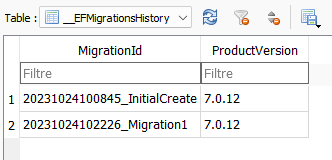

# Step 8 : Entity Framework

Note : EF Core 8 sort d'ici quelques jour. Il est probable qu'il faille revoir ce qui suit. 

Je parlerai d'entity framework CORE ici, même si parfois j'oublie le terme "Core". "Core" C'est pour le différencier de EF lié au .net Framework 4.6. (Microsoft nous perds avec ces noms, car le terme Core est abandonnée depuis .net6). 

Nous allons utiliser Entity Framework Core(EF). Pour cela on a deux choix
- Code First 
- Database First

Database First est utile lorsque la base de données existe déjà et qu'on a pas prévu d'y toucher. Dans ce cas le modèle de données sera calqué sur celle ci. 

Code First permet de ne pas gérer la base de données manuellement, mais de le faire avec le code, avec ce qu'on appelle des "migrations". 

Pour ma part, je n'ai encore jamais eu l'occasion de faire du Database First. Pour la bonne raison qu'en général les projets disposent déjà de leur propre couche d'accès aux données et que la réécriture avec EF Database First n'apporte rien (ou pas assez).

Nous utiliserons Code First. La base de données sera donc uniquement gérée par EF.

On va avoir besoin de la commande ```dotnet ef``` https://learn.microsoft.com/en-us/ef/core/cli/dotnet

Nous allons aussi utiliser Sqlite, qui est une base de donnée open source, petite, portable, serverless, rapide, cross platform qui se trouve dans un seul fichier. 

Sqlite est parfait pour de petit projet, même en production. Cependant il devra certainement être remplacé par un SGBD plus performant si la taille de la base augmente ou qu'il y a une montée en charge conséquente (surtout en écriture). De plus c'est pas une BD secure.

Choix d'une base de donnée est un sujet à part entière. D'ailleurs a t-on besoin d'une base de données, relationelle, nosql ... ?

## Mise en place

On va définir un DB Context qui est le point central d'entity framework core. 

### Model Entity

Comme je le disais précédement, à ce niveau, cad dans l'infrastructure j'utiliserai le terme Entity pour parler d'objet manipulé par Entity Framework. Nous allons donc créer cet objet :

```c#
public class WeatherForecastEntity
{
    public Guid Id { get; set; }
    public DateTime Date { get; set; }
    public int TemperatureC { get; set; }
    public int TemperatureF { get; set; }
    public string? Summary { get; set; }
    public bool Current { get; set; }
    public string? Country { get; set; }
    public string? City { get; set; }
    public decimal Latitude { get; set; }
    public decimal Longitude { get; set; }
}
```

On a quasiment le même objet, ce qui le différencie c'est l'Id. Par défaut, c'est la clé primaire de l'objet en base de données. (Ca pouvait aussi être WeatherForecastEntityId). On peut aussi rajouter l'attribut [Key] Source : https://learn.microsoft.com/en-us/ef/core/modeling/keys?tabs=data-annotations


### DB Context

Ajouter le package : Microsoft.EntityFrameworkCore.Sqlite, celui ci vient avec un ensemble de package dont Microsoft.EntityFrameworkCore

On commence par créer notre OnyxDbContext qui contriendra un DbSet de WeatherForecastEntity

```c#
public class OnyxDbContext : DbContext
{
    protected readonly IConfiguration Configuration;

    public OnyxDbContext(IConfiguration configuration)
    {
        Configuration = configuration;
    }

    protected override void OnConfiguring(DbContextOptionsBuilder options)
    {
        options.UseSqlite(Configuration.GetConnectionString("DefaultConnection"));
    } 

    public DbSet<WeatherForecastEntity> WeatherForecasts { get; set; }
}
```

Notez qu'on va mettre la connection string dans un fichier de settings. Ce qui va nous permettre de mettre le fichier de base de données Sqlite ou on veut, selon notre environnement (dev, staging, prod)

Dans notre Program.cs on rajoute

```c#
//Entity Framework Db Context
builder.Services.AddDbContext<OnyxDbContext>();
```

### DB Init

On va créer une classe static qui va faire deux choses :
- appliquer toutes les migrations pour s'assurer que base de données est à jour par rapport à notre code
- ajouter du contenu, quelques données pour démarrer (pratique au début d'un projet)

Un article intéressant https://jasontaylor.dev/ef-core-database-initialisation-strategies/ discute des approches que l'on peut avoir avec cette gestion des données, suivant l'avancé de notre projet. 

On ajoute donc une classe OnyxDbInitializer

```c#
public static class OnyxDbInitializer
{
    public static void CreateDbIfNotExists(IServiceScope scope, ILogger logger)
    {
        IServiceProvider? services = scope.ServiceProvider;

        if (services != null)
        {
            try
            {
                var context = services.GetRequiredService<OnyxDbContext>();

                Initialize(context, logger);
            }
            catch (Exception ex)
            {
                logger.LogError(ex, "An error occurred creating the DB.");
            }
        }
        else
        {
            logger.LogError("CreateDbIfNotExists error, service is null");
        }
    }

    public static void Initialize(OnyxDbContext context, ILogger logger)
    {
        try
        {
            //Important, apply all migrations before init. Usefull on staging/production
            context.Database.Migrate();

            var dbCreated = context.Database.EnsureCreated();

            logger.LogInformation("dbCreated : " + dbCreated);

            // Look for any WeatherForecasts.
            if (context.WeatherForecasts.Any())
            {
                return;   // DB has been seeded
            }

            var weatherForecasts = new List<WeatherForecastEntity>()
            {
                 new WeatherForecastEntity(){ City = "Paris", TemperatureC=23},
                 new WeatherForecastEntity(){ City = "Rennes", TemperatureC=22},
            };

            context.WeatherForecasts.AddRange(weatherForecasts);

            context.SaveChanges();
        }
        catch (Exception ex)
        {
            logger.LogError("Initialize DB error : " + ex.StackTrace);
        }
    }
}
```

Qu'on appelle dans le Program.cs 

```c#
//DB Inits
using (var scope = app.Services.CreateScope())
{
    var logger = scope.ServiceProvider.GetRequiredService<ILogger<Program>>();
    OnyxDbInitializer.CreateDbIfNotExists(scope, logger);
}
```

### Init migrations

Avant de lancer l'application il nous reste encore une chose à faire. Il faut initialiser les migrations avec une commande à la racine du projet Onyx.Web.Api, celui qui contient le  Program.cs

Il faudra au préalable installer le package Microsoft.EntityFrameworkCore.Design dans le projet "Onyx.Web.api"

```
dotnet ef migrations add InitialCreate
```


Cette commande créer un repertoire "Migrations" à la racine du projet. Celui ci va contenir, à terme, une liste de classe qui décrivent tous les changements opéré sur le modele de données (Nos Entities) et les appliquer dans la base de donnée. Par exemple, renommer une propriété dans un objet Entity se traduira par le renommage d'une colone d'une table en base de données. Tous est automatiquement géré ici. Dans le code lorsque l'on appelle ``` context.Database.Migrate(); ```, il va executer tout ce qui se trouve dans ce dossier. A ne surtout pas modifier manuellement si on ne sait pas ce qu'on fait. 

Le soucis ici, c'est que notre projet de démarrage qui contient Program.cs n'est pas le projet de destination de ce dossier Migration. 

Pour cela on va le préciser a la configuration du DbContext

```c#
protected override void OnConfiguring(DbContextOptionsBuilder options)
{
    options.UseSqlite(Configuration.GetConnectionString("DefaultConnection"),
         x => x.MigrationsAssembly("Onyx.Infrastructure"));
}
```

Il faudra alors taper cette commande : ``` dotnet ef migrations add InitialCreate --project ../Onyx.Infrastructure ``` 

Pour que le dossier Migrations apparaisse enfin ! Source https://learn.microsoft.com/en-us/ef/core/managing-schemas/migrations/projects?tabs=dotnet-core-cli

### First Run

Lancer l'application Onyx.Web.Api. Normalement vous allez voir de nouveaux fichiers dans le repertoire du fichier de setting (Onyx.Infrastructure/Datas/DB) dont un fichier .db qui est la base de donnée. Ouvrez le avec DB Browser for SQLite https://sqlitebrowser.org/ et vous verrez vos données.

Note : j'ai rajouté un fichier .gitignore qui ignore le dossier /Datas/DB. C'est en effet pas nécessaire de remonter ça au dépot git. 

Faite un petit test, arrêter le run. Supprimer le contenu du dossier Datas/DB/ et relancer l'app. Tout redevient comme avant ! 

Très pratique pour développer dans son coin, avec sa propre base de données. 

### La suite

Vos entities vont évoluer. Vous allez en créer d'autre, les modifiers, les supprimer. Une vie de développeur somme toute classique. 

Prenons un exemple. On va rajouter une propriété ``` public decimal Humidity { get; set; }``` à notre objet WeatherForecastEntity

Pour que la base de donnée soit à jour, nous devons le lui dire, par l'ajout d'une migration avec la commande suivante 

``` dotnet ef migrations add Migration1 --project ../Onyx.Infrastructure ``` 

Voici ce que cela a généré :

```c#
public partial class Migration1 : Migration
{
    /// <inheritdoc />
    protected override void Up(MigrationBuilder migrationBuilder)
    {
        migrationBuilder.AddColumn<decimal>(
            name: "Humidity",
            table: "WeatherForecasts",
            type: "TEXT",
            nullable: false,
            defaultValue: 0m);
    }

    /// <inheritdoc />
    protected override void Down(MigrationBuilder migrationBuilder)
    {
        migrationBuilder.DropColumn(
            name: "Humidity",
            table: "WeatherForecasts");
    }
}
```

Vous avez la possibilité de lancer la commande ``` dotnet ef database update ``` pour mettre la table à jour manuellement. (ou lancer votre app)

La base de donnée possède une table pour géré les migrations



Ce qui permet d'éviter de les re-jouer.

## Conclusions

Cette stratégie permet de développer efficacement. On ne touche pas à la base de données, sauf éventuellement en lecture pour débuger.

La base de données peut être supprimé entierement puis reconstruite entièrement avec une suite de migration. 

On a un la possibilité de l'alimenter au démarrage ce qui permet d'avoir un jeu de données pratique pour développer rapidement. 

De plus, les migrations sont automatiquement joué au run, donc les différents environnement comme le staging et la production auront aussi automatiquement ces mises à jour. 

Le jour où on souhaite changer de SGBD, on a "que" (en théorie ;) ) à changer qq lignes dans les settings et le Program.cs, sans toucher une ligne de code. 

La seule chose qu'on a à faire en tant que développeur, c'est penser à construire régulièrement nos migrations. 

J'aime beaucoup cette façon de travailler. 